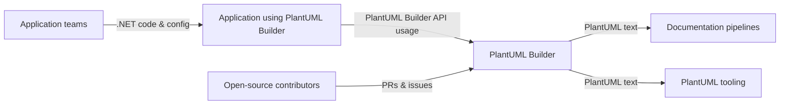

# 3. System Scope and Context

## System boundary

PlantUML Builder is responsible for generating PlantUML source text via .NET extension methods.
It does not render diagrams or provide a UI.

## Context diagram

## 3.1 Business context

| Partner                            | Relationship                                                                | Input/Output                                                     |
| ---------------------------------- | --------------------------------------------------------------------------- | ---------------------------------------------------------------- |
| Application teams                  | Use the library to generate diagrams as part of tooling or builds.          | Input: .NET code invoking extensions. Output: PlantUML text.     |
| Application using PlantUML Builder | Hosts the library and triggers diagram generation as part of its workflows. | Input: .NET code/configuration. Output: PlantUML text artifacts. |
| Documentation pipelines            | Consume generated PlantUML text for published docs.                         | Input: PlantUML text. Output: rendered diagrams.                 |
| Open-source contributors           | Extend or maintain the library.                                             | Input: PRs/issues. Output: improved command support.             |
