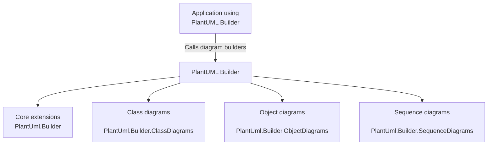

# 5. Building Block View

## 5.1 White-box Overview

- **Core StringBuilder extensions:** Core commands for diagram framing live in the root `PlantUml.Builder` namespace, including `UmlDiagramStart` and related helpers.
- **Class diagram extensions:** Class diagram-specific methods (like `Class`) live under `PlantUml.Builder.ClassDiagrams`.
- **Object diagram extensions:** Object diagram commands (like `Object` and `MapStart`) live under `PlantUml.Builder.ObjectDiagrams`.
- **Sequence diagram helpers:** Sequence diagram components (like arrow parsing and participants) are modeled in `PlantUml.Builder.SequenceDiagrams`.

| From | To | Relationship |
| --- | --- | --- |
| Application using PlantUML Builder | PlantUML Builder | Invokes diagram builders to generate PlantUML text. |
| PlantUML Builder | Core extensions | Provides diagram framing and shared helpers. |
| PlantUML Builder | Class diagrams | Supplies class diagram builders and helpers. |
| PlantUML Builder | Object diagrams | Supplies object diagram builders and helpers. |
| PlantUML Builder | Sequence diagrams | Supplies sequence diagram builders and helpers. |
