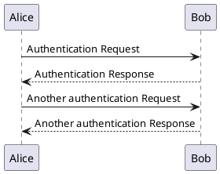

# PlantUML Builder


[](https://coveralls.io/github/eNeRGy164/PlantUml.Builder?branch=main)

**PlantUML Builder** is a library with StringBuilder extension methods to make it easier to generate valid PlantUML diagrams using .NET.

## Example

The following code:
```csharp
var stringBuilder = new StringBuilder();

stringBuilder.UmlDiagramStart();
stringBuilder.Arrow("Alice", "->", "Bob", "Authentication Request");
stringBuilder.Arrow("Bob", "-->", "Alice", "Authentication Response");
stringBuilder.AppendNewLine();
stringBuilder.Arrow("Alice", "->", "Bob", "Another authentication Request");
stringBuilder.Arrow("Alice", "<--", "Bob", "Another authentication Response");
stringBuilder.UmlDiagramEnd();

stringBuilder.ToString()
```

Generates the following output:


## Implemented commands status

See [Implemented commands](./docs/commands.md).
